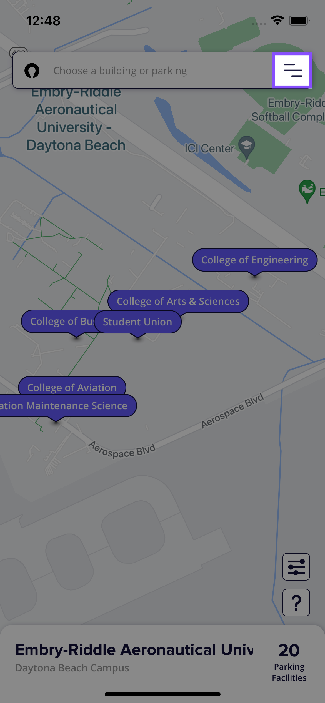
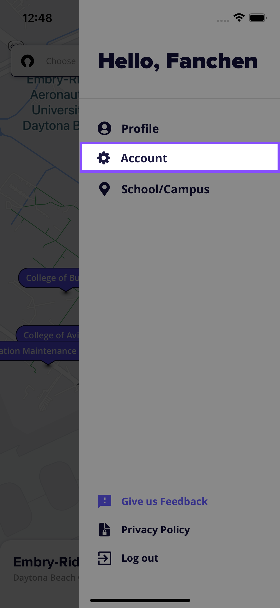
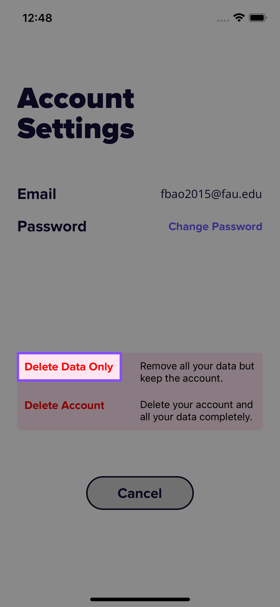
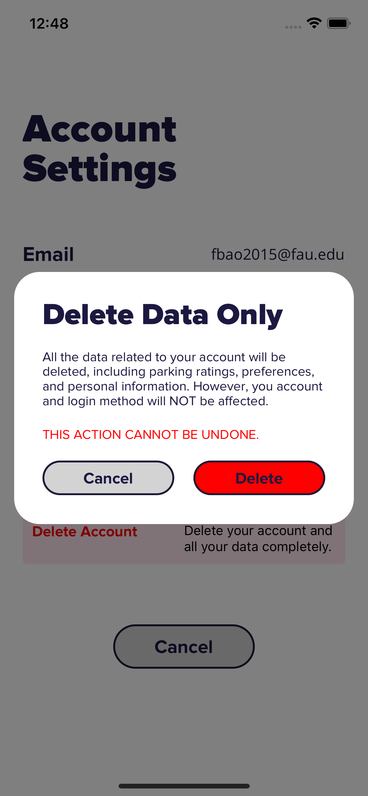
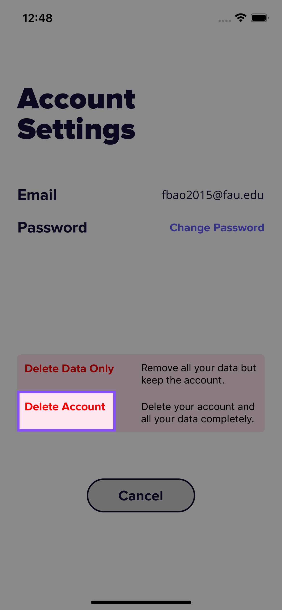
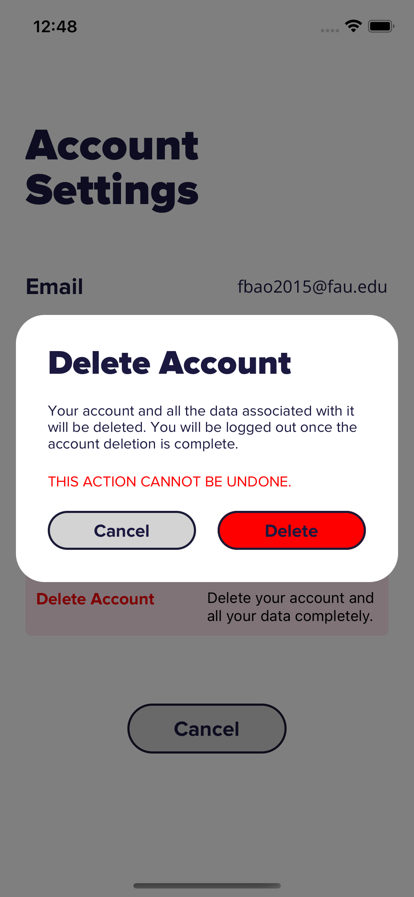

# Protect Your Privacy

Pika Parking takes your privacy very seriously. Therefore, we offer two easy options for those who wish to remove their data from our platform.

## Delete Data But Keep Your Account

This option removes all the data related to you, including your parking ratings, preferences, and personal information. However, your account and login method will NOT be affected. To proceed, follow the following steps.

1. Press the menu icon on top right side of the search bar

   

2. In the user management drawer, press "Account".

   

3. In the account setting screen, press “Delete Data Only”.

   

4. In the following dialog, press “Delete” to delete all your data but keep your account.

   

## Delete Your Account and All The Data

This option deletes your account and all the data associated with you. After the deletion, you will be automatically logged out. To proceed, follow the following steps.

1. Press the menu icon on top right side of the search bar

   

2. In the user management drawer, press "Account".

   

3. In the account setting screen, press “Delete Account”.

   

4. In the following dialog, press “Delete” to delete your account and all your data.

   
